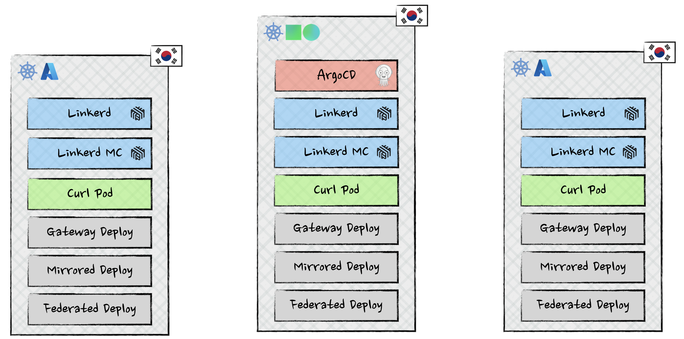

# DevKorea Multicloud GitOps Demo

GitOps sample for Linkerd Enterprise + Argo CD across multiple clouds. The setup provisions three Kubernetes clusters: two Azure AKS clusters and one Naver Cloud NKS cluster, all managed by a single Argo CD instance.

See the [presentation slides](assets/presentation.pdf) for an overview of the architecture and concepts.

## Repository Layout
- `terraform/`: Root module that orchestrates both cloud providers, Linkerd certificates, and Argo CD setup.
- `terraform/naver`: Provisions one NKS cluster with VPC/subnets (limited to one cluster due to NKS CIDR constraints).
- `terraform/azure`: Provisions two AKS clusters with VNet/subnets and peering.
- `terraform/argo/`: Argo CD Helm release and resource configurations (clusters, projects, ApplicationSets).
- `terraform/linkerd/`: Linkerd certificate generation and license management modules.
- `manifests/`: Linkerd multicluster credentials/secrets and sample `simple-app` workloads for each cluster.

## Architecture



## What It Creates
- **One NKS cluster** (`devkorea-nks-1`) on Naver Cloud with dedicated VPC/subnet.
- **Two AKS clusters** (`devkorea-aks-1`, `devkorea-aks-2`) on Azure with VNets and peering.
- Argo CD via Helm on `devkorea-nks-1` (LoadBalancer) with service accounts/tokens/role bindings to manage all three clusters.
- Linkerd Enterprise CRDs, control plane, and multicluster gateways via Argo CD ApplicationSets. TLS identity materials are generated by Terraform.
- Kubeconfigs output to `./kubeconfigs/` directory.

## Prerequisites
- Terraform CLI 1.6+; `kubectl`; Helm CLI (for troubleshooting).
- `ncp-iam-authenticator` for Naver Cloud:
  ```sh
  brew tap NaverCloudPlatform/tap
  brew install ncp-iam-authenticator
  export NCLOUD_ACCESS_KEY=********
  export NCLOUD_SECRET_KEY=********
  export NCLOUD_API_GW="https://ncloud.apigw.ntruss.com"
  ```
- Azure CLI (`az`) authenticated with your subscription.
- Naver Cloud credentials: `access_key`, `secret_key`, `account_id`.
- Azure credentials: `tenant_id`, `subscription_id`, `client_id`, `client_secret`.
- Linkerd Enterprise license (base64) and optional `linkerd_enterprise_version` override (default `2.19.4`).
- Argo CD admin password bcrypt hash:
  ```sh
  ARGO_PWD="choose-a-strong-password"
  ARGO_PWD_BCRYPT=$(argocd account bcrypt --password "$ARGO_PWD")
  export TF_VAR_argocd_admin_password_bcrypt="$ARGO_PWD_BCRYPT"
  ```

## Deployment
1. Create a tfvars file (do not commit), e.g. `terraform/dev.tfvars`:
   ```hcl
   # Naver Cloud
   access_key = "NCLOUD_ACCESS_KEY"
   secret_key = "NCLOUD_SECRET_KEY"
   account_id = "NCLOUD_ACCOUNT_ID"

   # Azure
   tenant_id       = "AZURE_TENANT_ID"
   subscription_id = "AZURE_SUBSCRIPTION_ID"
   client_id       = "AZURE_CLIENT_ID"
   client_secret   = "AZURE_CLIENT_SECRET"

   # Linkerd
   linkerd_enterprise_license = "BASE64_LICENSE_STRING"
   # linkerd_enterprise_version = "2.19.4"

   # Argo CD (or use TF_VAR_argocd_admin_password_bcrypt)
   argocd_admin_password_bcrypt = "$2a$10$..."
   ```

2. Initialize and apply from the root terraform directory:
   ```sh
   terraform -chdir=terraform init
   terraform -chdir=terraform apply -var-file=dev.tfvars
   ```

3. Kubeconfigs are automatically generated in `./kubeconfigs/`:
   - `kubeconfig-devkorea-nks-1.yaml`
   - `kubeconfig-devkorea-aks-1.yaml`
   - `kubeconfig-devkorea-aks-2.yaml`

## Access Argo CD
Fetch the LoadBalancer hostname/IP:
```sh
kubectl --kubeconfig ./kubeconfigs/kubeconfig-devkorea-nks-1.yaml -n argocd get svc argocd-server
```
Log in with user `admin` and the password you used to generate the bcrypt hash.

## Linkerd Multicluster
- Linkerd link secrets are managed under `manifests/devkorea-*/linkerd/`.
- Sample multicluster workloads are under `manifests/devkorea-*/simple-app/`; apply them to the corresponding clusters, then use `kubectl -n simple-app get pods,svc -o wide` or exec into the `curl` pod for traffic checks.

## Cleanup
```sh
terraform -chdir=terraform destroy -var-file=dev.tfvars
```
